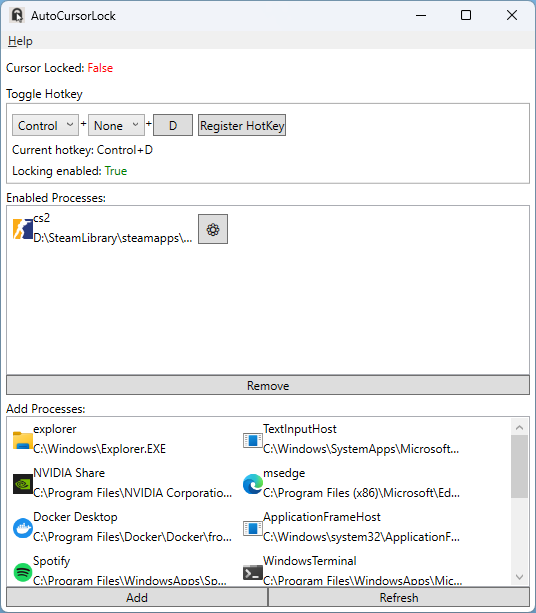

# AutoCursorLock

Locks the cursor to a specified window or monitor while an application is in focus.

## Description

When playing certain games with multiple monitors you may find your cursor leaves the game window and enters the other monitor(s).

This program will detect when a program like CS:GO is in focus and lock the cursor to the game. 
The cursor will automatically unlock when you Alt-Tab and relock when the game comes back into focus.
There is also a hotkey to disable/enable the auto-locking.

Games that accidentally allow the cursor to leave the game window.

- Counter-Strike: Global Offensive
    - Known to occasionally allow the cursor to leave the game for a split second during fast movements.
      Clicking the mouse during this period Alt-Tabs your game and focuses on whatever window was on your other monitor,
      preventing the game from registering any of your inputs until you manually refocus the game window.
- Skyrim
    - Makes your cursor invisible and capture your clicks,
      but may allow scrolling to be captured by any windows your mouse is hovering over at the time.

### How does this program compare to other cursor-locking programs?

- AutoCursorLock can lock your cursor to the window's border, or whole screen.
- The locks are enabled automatically when the window comes into focus.
- You can open the program, minimize it to the tray, and forget about it.
- You can Alt-Tab in and out of the game freely and be sure the cursor will be locked
again when the game comes back into focus without manually toggling the locking with a hotkey.

## Usage

Start the program and select an item from the automatically populated processes list.
Click the Add button to start automatically locking on that process' windows.
The selections are saved to `%appdata%/AutoCursorLock/settings.json` and loaded automatically on program start.

Press your configured hotkey to toggle auto locking when a selected process is in focus,
or alternatively use Alt+Tab to focus on a window that you did not configure to lock the cursor.

## FAQ

### Why do some applications have a question mark icon?

This probably means AutoCursorLock experiences a permission denied error when inspecting the process.
This is a flag that processes can set and there is nothing AutoCursorLock can do to resolve this.
The good news is that other than the icon and application path missing, AutoCursorLock should work as usual.

### I have an issue, where are the logs?

If you are experiencing technical issues with AutoCursorLock, please include logs in your GitHub issue.
The application logs can be found in `%appdata%/AutoCursorLock/log.txt`.

## Planned Features

- Manual selection of processes from file explorer

## Contributing

Go for it! Always happy to have help.